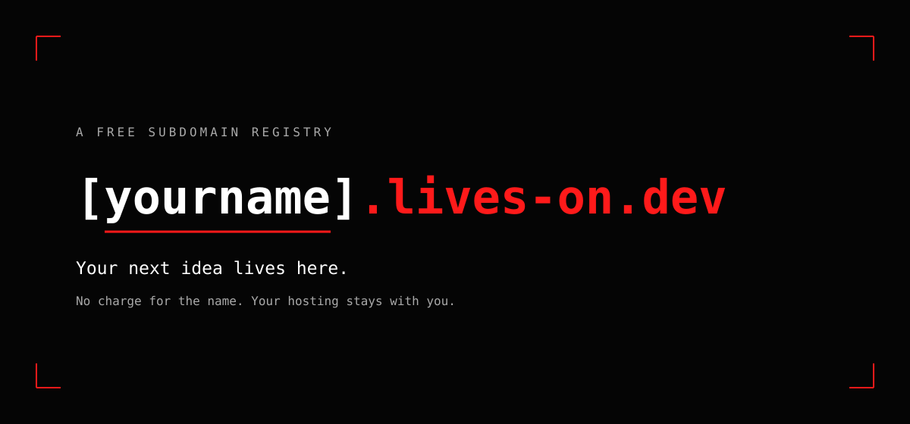

<p align="center">
  <a href="https://lives-on.dev"></a>
</p>

<h1 align="center">lives-on.dev</h1>

<p align="center">Free subdomains for personal developer projects.<br />Choose <strong><code>yourname.lives-on.dev</code></strong>. Keep your hosting. Make it yours.</p>

<p align="center">
  <a href="https://lives-on.dev"><strong>Claim a name</strong></a> ·
  <a href="https://lives-on.dev/docs/quickstart">Quickstart</a> ·
  <a href="https://lives-on.dev/docs/guides">Guides</a> ·
  <a href="https://lives-on.dev/record/edit">Records</a> ·
  <a href="https://lives-on.dev/faq">FAQ</a> ·
  <a href="https://lives-on.dev/policy">Policy</a>
</p>

<p align="center">
  <a href="https://github.com/Bhav3shChawla/lives-on.dev/stargazers"></a>
  <a href="https://github.com/Bhav3shChawla/lives-on.dev/actions/workflows/validate.yml"></a>
  <a href="https://lives-on.dev/policy"></a>
  <a href="https://lives-on.dev/docs/guides"></a>
</p>

---

## What this is

lives-on.dev is a subdomain registry, not a hosting provider or a top-level domain. We provide the address; your provider runs your website.

This repository contains the approved public records in [`registry/domains/`](registry/domains/). Pending claims and drafts are stored by the website until reviewed. A saved claim is not an active DNS record.

**Public beta:** requests are manually reviewed before DNS publication. Check the website for current registration availability. The name is free; your hosting provider may charge for its services. Availability and permanent service are not guaranteed.

## Why lives-on.dev?

A portfolio or side project deserves an address you can share without moving the website behind it. Use the same name when you change hosting providers: update the destination instead of handing out a new link.

- **Bring your own hosting.** Your code, content, accounts, and deployments stay with you.
- **Readable public records.** Approved ownership and DNS definitions can be inspected here, with Git history showing changes.
- **GitHub identity.** Sign in with the account that will own your claim; there is no separate lives-on.dev password.
- **Reviewed registrations.** Names and destinations are checked before publication, with a reporting channel for abuse and disputes.

This is deliberately a subdomain service. You receive permission to use an address under lives-on.dev, not ownership of the parent domain or a new top-level domain.

## Claim your name

1. Visit [lives-on.dev](https://lives-on.dev) and enter the name you want. Availability is checked before sign-in.
2. Sign in with GitHub to save an available name. One claim per GitHub account.
3. Add the full address to your hosting provider's custom-domain settings.
4. Open [Configure your DNS records](https://lives-on.dev/record/edit) and enter the exact records your host supplies.
5. **Save record**, then **Submit saved record for review**. Follow the linked GitHub request.
6. After approval and successful DNS publication, finish verification and HTTPS setup at your host.

Copying or downloading JSON does not submit or publish it. Do not treat a pending claim, merged request, or working default hosting URL as proof that the custom address is ready.

### What each stage means

| Stage | What it means | What to do next |
| --- | --- | --- |
| Available | The name is available at the time of the check; it is not reserved for you yet. | Sign in to claim it. Availability is checked again when saving. |
| Claim saved | Your account has a claim, not a live website address. | Configure the host and destination. |
| Records saved | Your draft is stored in your account. | Submit the saved revision for review. |
| In review | A request exists on GitHub. | Follow feedback and correct any validation problems. |
| DNS published | Approved records have been applied. | Let DNS caches update and finish provider verification. |
| HTTPS ready | Your host serves the right site with a valid certificate. | Test pages, assets, and any redirects. |

There is no promised instant-activation deadline. Review, DNS propagation, ownership verification, and certificate provisioning are different stages.

## Point it at your own hosting

Choose a guide for your provider:

- [Vercel](https://lives-on.dev/docs/guides/vercel)
- [Netlify](https://lives-on.dev/docs/guides/netlify)
- [GitHub Pages](https://lives-on.dev/docs/guides/github-pages)
- [Cloudflare Pages](https://lives-on.dev/docs/guides/cloudflare-pages)
- [Render](https://lives-on.dev/docs/guides/render)
- [Railway](https://lives-on.dev/docs/guides/railway)
- [Firebase Hosting](https://lives-on.dev/docs/guides/firebase-hosting)
- [Replit](https://lives-on.dev/docs/guides/replit)
- [Codeberg Pages](https://lives-on.dev/docs/guides/codeberg-pages)

The guides explain provider-specific verification and compatibility limits. Additional DNS labels may require maintainer coordination. You cannot verify ownership of the parent domain or change its nameservers.

## What a record looks like

An illustrative CNAME record at `registry/domains/yourname.json`:

```json
{
  "owner": {
    "username": "your-github-username"
  },
  "records": {
    "CNAME": "replace-with-provider-target.example"
  }
}
```

The destination above is a placeholder, not working hosting. Use the exact target supplied by your own provider. Published records can also include the owner's numeric GitHub ID.

- **CNAME:** a hostname, without `https://`, a port, or a path. It must be the only record type at that name.
- **A / AAAA:** IPv4 / IPv6 addresses supplied by your host.
- **TXT:** public verification values. Keep permanent verification records when your host requires them for certificate renewal.
- **Multiple records:** use the editor's Advanced mode for compatible records at your claimed name. Separate verification hostnames require review.

See the [record schema](registry/schema.json) and [hosting guides](https://lives-on.dev/docs/guides). DNS destinations and ownership identifiers are public. **Never submit passwords, API tokens, private keys, or private account information.**

### Record formats and combinations

These describe the registry's data format, not a guarantee that every use case or provider will be approved.

| Type | Value inside `records` | Notes |
| --- | --- | --- |
| `CNAME` | One hostname string | Cannot coexist with any other record at the same name. |
| `A` | An IPv4 string or array of IPv4 strings | Use the address supplied by your host. |
| `AAAA` | An IPv6 string or array of IPv6 strings | Only add this if your host supports IPv6 for the custom domain. |
| `TXT` | A string or array of strings | Verification data is public; each value must satisfy validation limits. |
| `MX` | An array of `{ "target": "mail.example.com", "priority": 10 }` objects | Requires a separate mail provider; this registry does not supply a mailbox. |
| `CAA` | An array of `{ "flags": 0, "tag": "issue", "value": "letsencrypt.org" }` objects | Certificate-authority restrictions can prevent HTTPS issuance. Coordinate changes carefully. |
| `NS`, `SRV`, `TLSA`, `DS` | Advanced records defined by the schema | Ask for review before relying on delegation, service labels, or DNSSEC changes. |
| `URL` | One public HTTPS URL | A redirect instruction, not a DNS record. Must stand alone; redirects depend on the redirect service. |

The editor's Advanced field takes the **records object only**, not the entire registration. For example, a provider requiring an IPv4 address and verification TXT at the same name would use:

```json
{
  "A": ["192.0.2.10"],
  "TXT": ["replace-with-your-provider-verification-value"]
}
```

**Illustration only:** `192.0.2.10` is a documentation address, not a working hosting destination. Replace both values with your provider's instructions. Do not add CNAME beside them.

Adding a TXT value here publishes it at your claimed name. It does **not** create `_verification.yourname.lives-on.dev`. If a host asks for another label, contact support with the exact hostname, record type, and value.

## Update, move, or remove your site

**Changing hosts:** configure the new host for your custom domain, update your saved records, and submit the revision. Keep the old host working until the approved change is published and the new site passes HTTPS checks. Keep any verification records your provider needs for renewal.

**Fixing a request:** follow the feedback on the linked review request. Save the corrected records before submitting again, and check which revision is being reviewed. Editing a draft does not change live DNS.

**Removing a name:** sign in and use the removal request where available, or contact support from an account that can demonstrate ownership. Wait for confirmed DNS removal before deleting the hosting project. This avoids leaving a name pointed at a destination someone else might claim.

## Troubleshooting

| What you see | What to check |
| --- | --- |
| Name unavailable | It may already be claimed, reserved, or invalid. Choose another name; a preview is not a reservation. |
| Pending review | Saving is not publication. Open the review request and check for feedback. |
| DNS still points to the old host | Confirm publication succeeded, then account for resolver caching. Repeatedly changing the draft will not flush caches. |
| Host says the domain is unverified | Confirm the full custom domain is added to that project and every requested verification record is present. |
| HTTPS warning | Wait for the host's certificate provisioning, check conflicting records and CAA restrictions, and follow that provider's guide. Do not bypass warnings. |
| Custom domain shows a 404 or the wrong site | Check the project/domain association and exact DNS destination. A working default hosting URL alone is not enough. |
| A page path does not work | DNS selects a hostname, not `/project` paths. Configure paths and redirects in your application or host. |

If you still need help, send the affected subdomain, hosting provider, exact error, and whether the request was published. Redact private dashboard details and credentials.

## Rules and responsibilities

- Personal, non-commercial developer projects only. Your destination must contain meaningful, publicly reviewable content.
- Use accurate ownership information. Only the recorded owner may request changes to a registration.
- No phishing, malware, spam, impersonation, abusive content, resale, or other prohibited use.
- Keep your hosting and certificates working. Request DNS removal before abandoning the destination.
- The parent domain is not on the Public Suffix List. Do not set parent-domain cookies or interfere with other subdomains; shared-domain security limitations still apply.

Read the [service policy](SERVICE_POLICY.md), [website policy](https://lives-on.dev/policy), and [privacy notice](https://lives-on.dev/privacy). Requests can be declined, and harmful registrations can be suspended.

## Contributing

Found a documentation error or a registry problem? Open an issue with enough detail to reproduce it. For your own domain changes, use the signed-in editor so the request includes the correct ownership information. Keep proposed changes focused and never include credentials.

Report security vulnerabilities and abuse privately by email rather than posting sensitive details in a public issue.

## Report abuse or get help

Email **[reports@lives-on.dev](mailto:reports@lives-on.dev)** for abuse, security issues, privacy requests, or domain disputes. Include the affected address and relevant evidence, not passwords or private keys.

---

Built by [Bhavesh Chawla](https://github.com/Bhav3shChawla). Like the project? **[Star this registry on GitHub](https://github.com/Bhav3shChawla/lives-on.dev)** to show your support.
